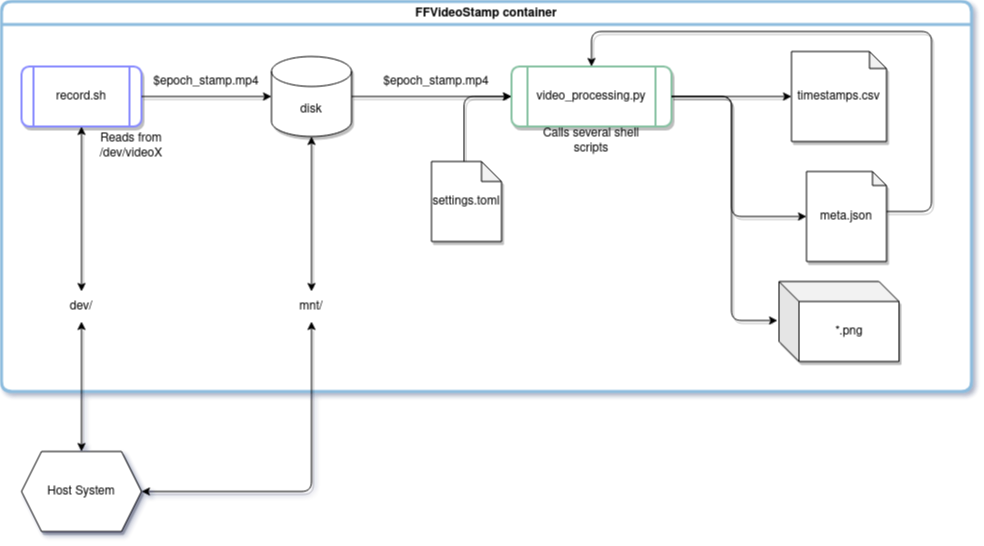

# FFVideoStamp
A small dockerized Python and Shell project to record video data and process them further in terms of time stamping, following the overview below.




## Getting Started

To get the project running, docker is recommended but not strictly necessary. The following steps will record a video and process the file afterward. Ensure, that all files can be executed (`sudo chmod +x file.sh`). Take a look into `cfg/settings.toml` to enable/disable png-extraction etc.

1. Build docker `./build_docker.sh`
2. Start docker after adapting the mounts in `start_docker.sh` with `./start_docker.sh`
3. Inside docker: `./record.sh 4` if you want to record dev/video4 for instance. Defaults to /dev/video0.
4. Optional: Generate a folder and move the video file to it (`python3 ./src/slug.py` will give you a good name)
5. If 4: -> Change line `19` in `video_processing.py` accordingly
6. Run `python3 ./video_processing.py`

The video file is named as the epoch time of the system at creation time. Since time increases between the creation of the file container and the start of the recording, `record.sh` also writes the epoch time at the very beginning into the metadata. This information is then read and processed in the latter.

### Prerequisites
If you are not using the provided Dockerfile to build the docker container, you can simply run all scripts on your host system. Therefore, the following packages and tools are required to get it running.
#### Python requirements

```
coolname==2.2.0
pandas==1.5.0
toml==0.10.2
```

#### FFmpeg
If ffmpeg is not installed on the system or not all used packages are built, use the following configuration to build it from source code.

1. `sudo apt update`
2. `sudo apt install build-essential pkg-config git libtool automake cmake yasm libv4l-dev`
3. `git clone https://github.com/FFmpeg/FFmpeg.git`
4. `cd FFmpeg`
5. `./configure --enable-gpl --enable-postproc --enable-swscale --enable-pthreads --enable-libx264 --enable-libv4l2`
6. `make -j$(nproc)`
7. `sudo make install`

I tested it with commit `33698ef891bac5f09fe0ec26af9b24322d7594ce`


### Installation

To build the docker container simply run `./build_docker.sh`

## Usage

Start the docker container with `./start_docker.sh`. Ensure that the mount in it is adapted accordingly.
To evaluate the difference between the displayed time on the screen and the recorded time stamp, `chrono.sh` is your friend. This script simply displays the epoch time with maximal framerate on the screen. You can record it directly and compare the time stamps later on.

## License

This project is licensed under the MIT-License - see the [LICENSE.md](LICENSE.md) file for details.